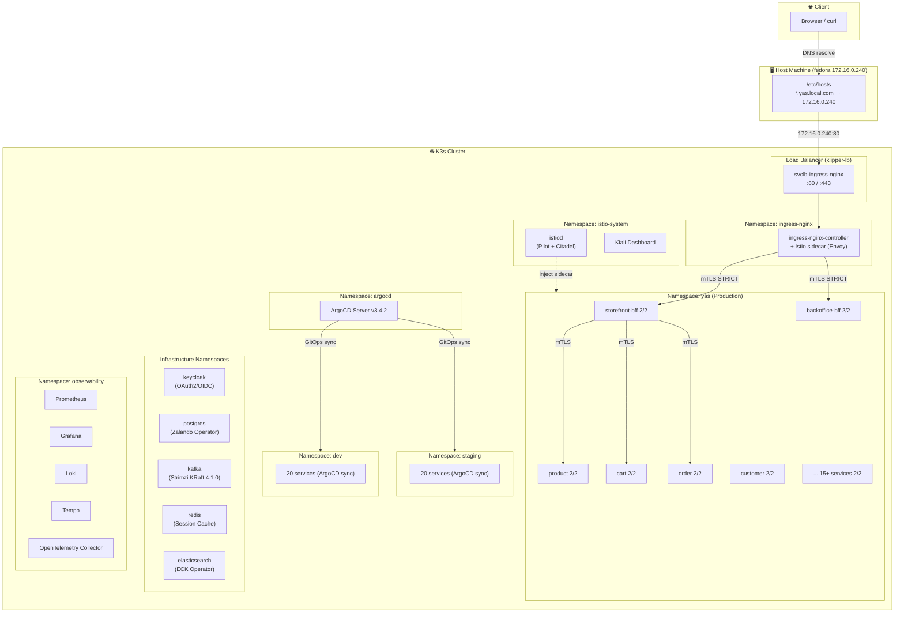
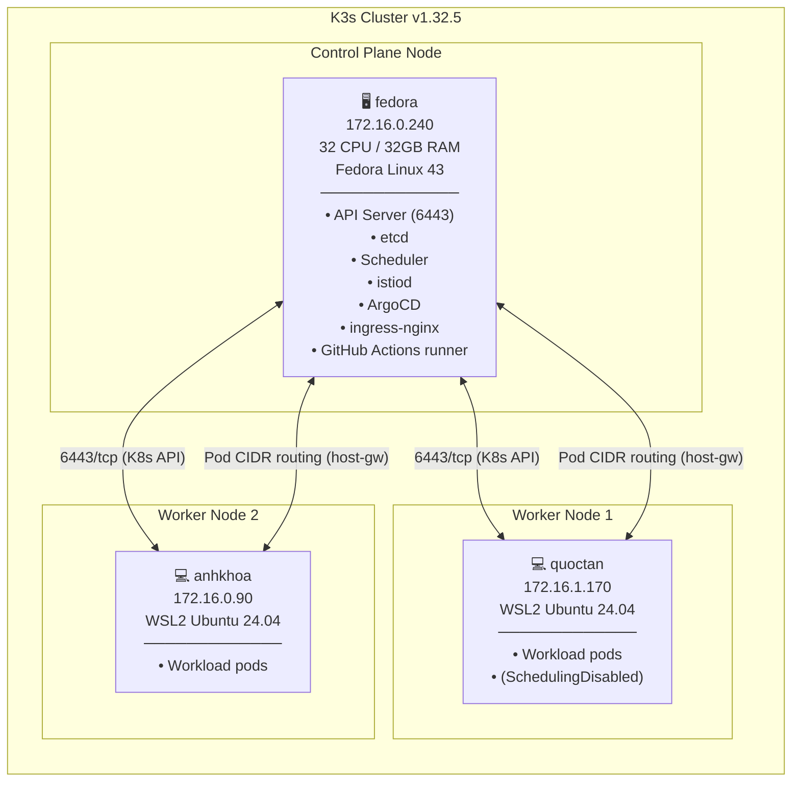
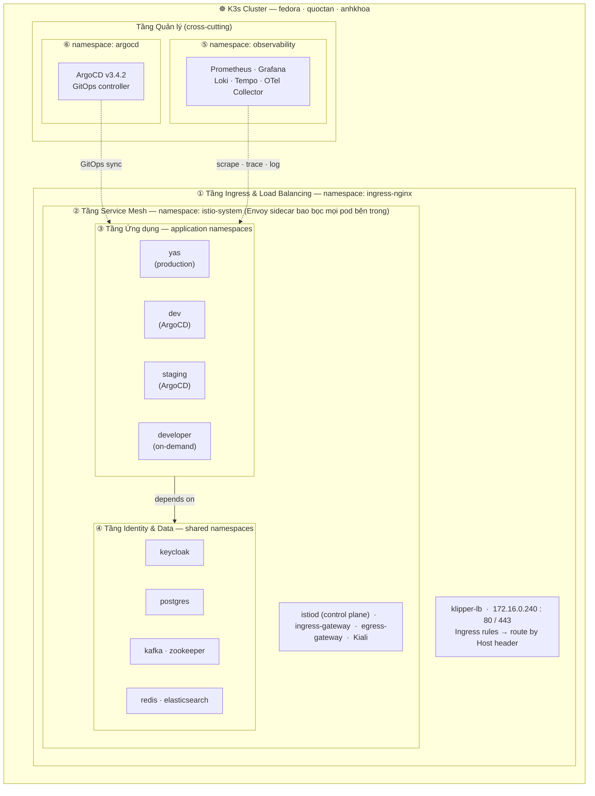
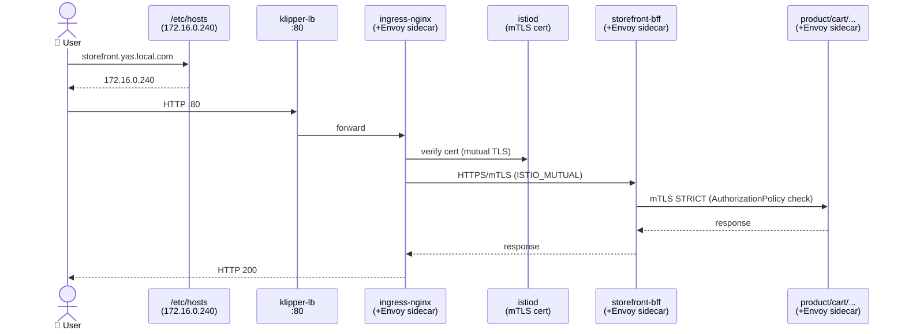
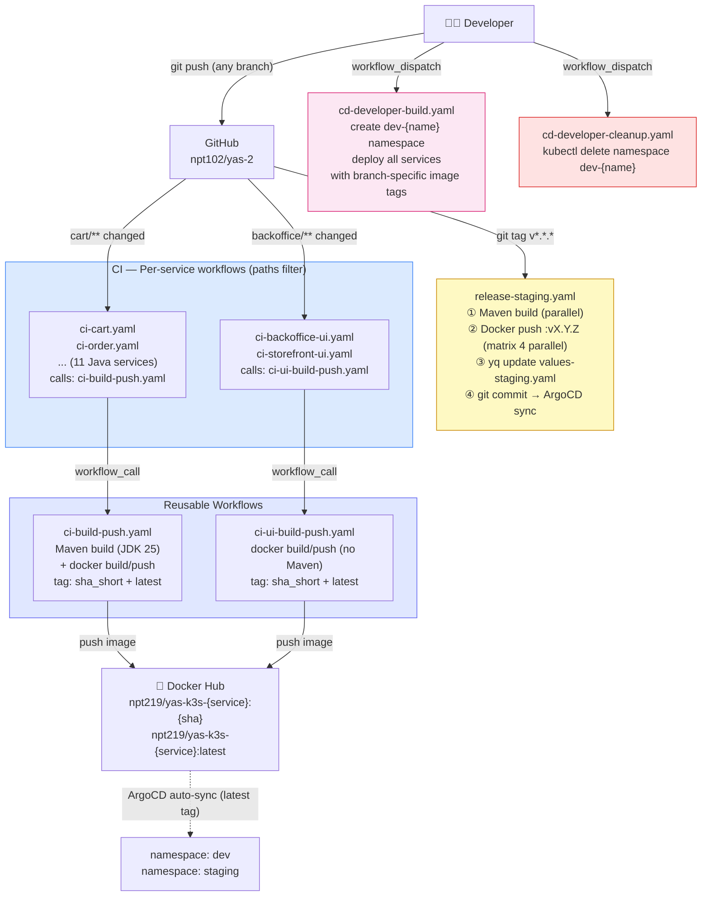
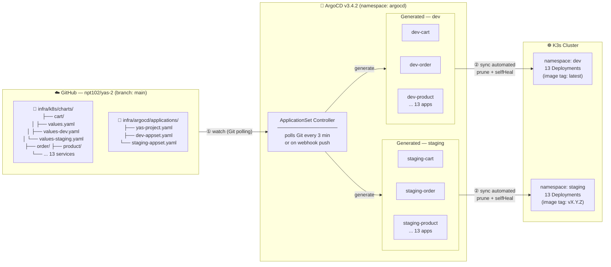
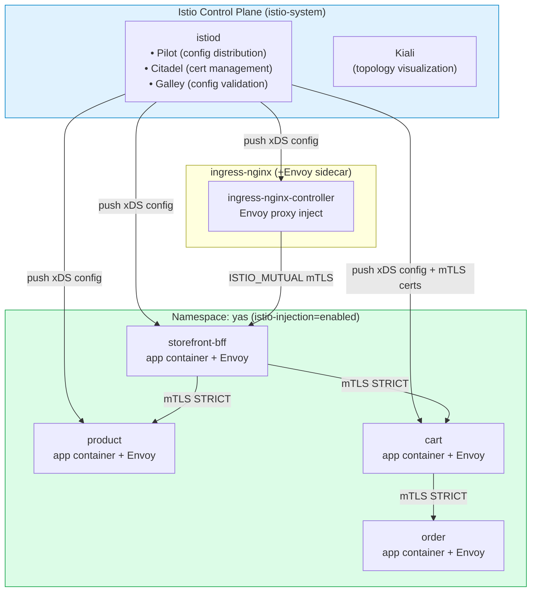
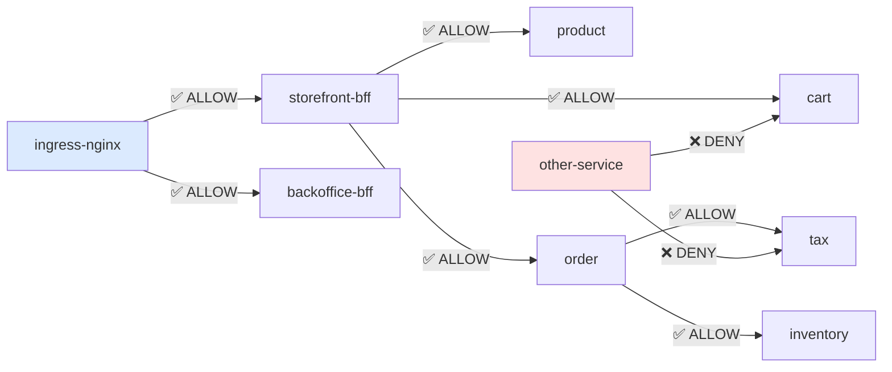
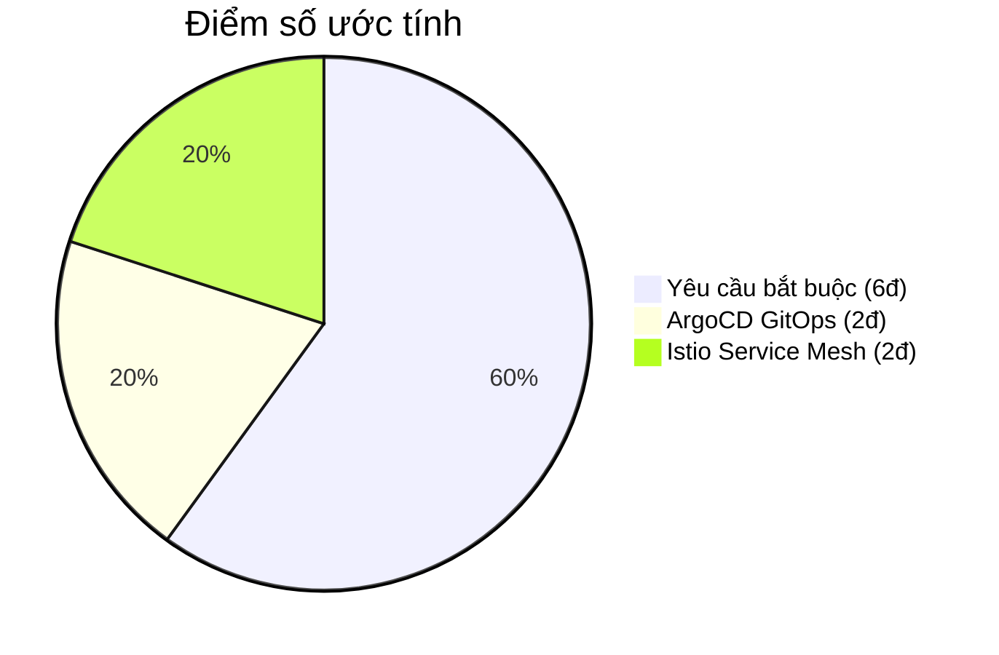

# Báo cáo Đồ án 2 — CI/CD & DevOps với YAS Microservice trên K3s + Istio

> **Môi trường:** K3s v1.32.5 · Fedora Linux 43 · Istio 1.24.3 · ArgoCD v3.4.2  
> **Ứng dụng:** YAS (Yet Another Shop) — e-commerce microservice

---

## Mục lục

1. [Tổng quan Đồ án](#1-tổng-quan-đồ-án)
2. [Kiến trúc Hệ thống](#2-kiến-trúc-hệ-thống)
3. [Cấu hình Hạ tầng](#3-cấu-hình-hạ-tầng)
4. [Pipeline CI/CD](#4-pipeline-cicd)
5. [ArgoCD — GitOps](#5-argocd--gitops)
6. [Service Mesh — Istio](#6-service-mesh--istio)
7. [Kiểm thử](#7-kiểm-thử)
8. [Vấn đề gặp phải & Cách khắc phục](#8-vấn-đề-gặp-phải--cách-khắc-phục)
9. [Kết luận](#9-kết-luận)

---

## 1. Tổng quan Đồ án

### 1.1 Giới thiệu

Đồ án 2 yêu cầu xây dựng hệ thống **CI/CD hoàn chỉnh** để triển khai, vận hành và giám sát ứng dụng microservice **YAS — Yet Another Shop** trên nền tảng Kubernetes.

YAS là ứng dụng thương mại điện tử mã nguồn mở theo kiến trúc microservice, gồm hơn 20 service viết bằng Java/Spring Boot và Next.js, tích hợp các công nghệ hiện đại: Kafka, Elasticsearch, Keycloak, OpenTelemetry, Grafana, Loki, Prometheus, Tempo.

---

## 2. Kiến trúc Hệ thống

### 2.1 Sơ đồ tổng thể



### 2.2 Sơ đồ K3s Multi-node Cluster



| Node | Role | IP | OS | Pod CIDR |
|------|------|----|----|----------|
| `fedora` | control-plane, master | 172.16.0.240 | Fedora Linux 43 | 10.42.0.0/24 |
| `quoctan` | worker (disabled) | 172.16.1.170 | Ubuntu 24.04 (WSL2) | 10.42.1.0/24 |
| `anhkhoa` | worker | 172.16.0.90 | Ubuntu 24.04 (WSL2) | 10.42.2.0/24 |

> **Flannel backend: `host-gw`** — routing trực tiếp qua L2, không encapsulation (VXLAN). Nhanh hơn nhưng yêu cầu nodes phải cùng L2 subnet hoặc có static route.

### 2.3 Sơ đồ Namespace Phân tầng



> **Đọc sơ đồ:** Mỗi khung lồng nhau thể hiện quan hệ bao bọc thực tế.
> - **Ingress** (①) bao bọc toàn bộ hệ thống — tất cả traffic từ ngoài vào đều qua đây.
> - **Service Mesh** (②) bao bọc **Applications** (③) và **Data** (④) — Istio inject Envoy sidecar vào mọi pod trong các namespace này, thực thi mTLS và policy.
> - **Applications** (③) phụ thuộc vào **Data** (④) — cùng được bảo vệ bởi Istio.
> - **Observability** (⑤) và **GitOps** (⑥) là các layer quản lý ngang (cross-cutting) — không nằm trong luồng traffic nhưng tương tác với tất cả các tầng.

### 2.4 Sơ đồ Luồng Traffic



---

## 3. Cấu hình Hạ tầng

### 3.1 Lý do chọn K3s thay Minikube

#### Bối cảnh & Vấn đề gặp phải với Minikube

Ban đầu, nhóm sử dụng **Minikube** để triển khai YAS trên môi trường local. Tuy nhiên khi scale lên 20 microservices + observability stack (Loki, Prometheus, Grafana), liên tiếp xảy ra các sự cố:

1. **OOM (Out of Memory):** Minikube chạy toàn bộ Kubernetes bên trong một VM (hay Docker container). Overhead VM cộng thêm 2–3 GB RAM. Khi cài thêm Loki + Prometheus + 10 Spring Boot services, tổng RAM vượt giới hạn → Linux OOM killer kích hoạt → kill `kubelet` và `kube-apiserver` → cluster die hoàn toàn.

2. **Port 80/443 không tự động:** Minikube không expose LoadBalancer services ra máy host theo mặc định. Phải chạy `minikube tunnel` trên terminal riêng, session đóng là mất access — không thể để background daemon.

3. **inotify reset sau restart:** Minikube VM reset kernel parameters về default mỗi lần restart. Promtail (log collector) và Kafka Connect cần `inotify.max_user_watches` cao → sau mỗi lần restart cluster phải chạy lại `sysctl` thủ công.

4. **Single-node:** Minikube chỉ chạy được 1 node. Không thể test multi-node scheduling, pod anti-affinity, hay mô phỏng node failure.

#### So sánh Minikube vs K3s

| Tiêu chí | Minikube | K3s | Ý nghĩa thực tế |
|----------|----------|-----|----------------|
| **Cơ chế chạy** | VM hoặc Docker-in-Docker | Systemd service (native Linux process) | K3s chạy trực tiếp trên OS — không có tầng ảo hóa trung gian, syscall đi thẳng vào kernel |
| **RAM overhead** | ~2–3 GB (cho VM/container) | ~512 MB (chỉ một binary `k3s`) | Tiết kiệm 1.5–2 GB RAM cho workload thực tế |
| **Port 80/443** | Cần `minikube tunnel` (chạy foreground) | Tự động qua `klipper-lb` (DaemonSet) | K3s bind port 80/443 trực tiếp trên mọi node, không cần thêm lệnh |
| **Auto-start sau reboot** | Phải `minikube start` thủ công | `systemctl enable k3s` → start cùng OS | Cluster luôn sẵn sàng sau khi máy reboot, không cần intervention |
| **inotify limit** | Reset về default mỗi lần restart VM | Persist trong `/etc/sysctl.d/99-k3s.conf` | Chạy một lần, có hiệu lực vĩnh viễn — Promtail/Kafka không còn crash |
| **Worker node thật** | Không hỗ trợ (single-node) | Có — join bằng `k3s agent` | Có thể thêm máy WSL2 (`quoctan`, `anhkhoa`) làm worker thật |
| **Binary size** | ~500 MB (nhiều component) | ~50 MB (all-in-one binary) | K3s tích hợp containerd, CNI, CoreDNS vào 1 binary duy nhất |
| **Ingress built-in** | Không (cần addon) | Có thể disable traefik, cài nginx | Linh hoạt hơn trong việc chọn ingress controller |
| **Kafka/Promtail stability** | Dễ crash do inotify limit tụt về default | Ổn định — kernel params giữ nguyên | Observability stack chạy liên tục không gián đoạn |

#### Kiến trúc K3s so với Kubernetes tiêu chuẩn

```
Kubernetes tiêu chuẩn:              K3s:
┌─────────────────────────┐         ┌──────────────────────────┐
│  kube-apiserver         │         │                          │
│  kube-scheduler         │  →→→    │   /usr/local/bin/k3s     │
│  kube-controller-manager│         │   (single binary ~50MB)  │
│  etcd                   │         │   etcd → SQLite/embedded │
│  kubelet                │         │   containerd built-in    │
│  container runtime      │         │   CNI (flannel) built-in │
└─────────────────────────┘         └──────────────────────────┘
  ~6 separate processes               1 process, ~512MB RAM
```

K3s gộp tất cả control-plane components vào **1 binary duy nhất**, thay thế `etcd` bằng SQLite (cho single-node) hoặc embedded etcd (cho HA), và tích hợp sẵn containerd + CNI.

#### Quyết định cuối cùng

> Sau khi Minikube crash do OOM (Linux OOM killer kill `kubelet` + `kube-apiserver` khi tổng RAM sử dụng vượt ngưỡng), nhóm chuyển hoàn toàn sang **K3s v1.32.5+k3s1** — bản LTS ổn định, không có race condition của v1.35.x trong `cloud-controller-manager`. Cluster mới gồm 3 node: `fedora` (control-plane), `quoctan` (WSL2 worker), `anhkhoa` (WSL2 worker).

### 3.2 Cài đặt K3s Control Plane

**Mục đích:** Khởi tạo node master trên máy `fedora` — bước này cài đặt và khởi động toàn bộ control-plane components (API server, embedded etcd, scheduler, controller-manager) dưới dạng một systemd service duy nhất. Sau bước này, `fedora` trở thành trung tâm điều phối của cluster, sẵn sàng nhận worker node join vào.

---

#### Bước 1 — Cài đặt K3s binary

**Tại sao cần làm:** K3s không có trong package manager của Fedora. Script cài đặt chính thức tải binary, tạo systemd service, và khởi động cluster trong một lệnh duy nhất.

```bash
curl -sfL https://get.k3s.io | INSTALL_K3S_VERSION=v1.32.5+k3s1 sh -s - \
  --disable=traefik \
  --write-kubeconfig-mode=644
```

Giải thích từng thành phần:

| Tham số | Giải thích |
|---------|-----------|
| `curl -sfL` | `-s` silent (không in progress bar), `-f` fail với exit code khác 0 nếu HTTP error, `-L` follow redirect — đảm bảo script tải về hoàn chỉnh trước khi pipe vào shell |
| `INSTALL_K3S_VERSION=v1.32.5+k3s1` | Ghim cứng version — không để K3s tự chọn `latest`. Lý do: K3s v1.35.x có race condition trong `cloud-controller-manager` (CCM): khi RBAC chưa kịp khởi tạo xong, CCM gặp `403 Forbidden` → crash loop vĩnh viễn. v1.32.5 là bản LTS stable đã được kiểm chứng |
| `--disable=traefik` | Tắt Traefik ingress controller mặc định của K3s. Lý do: dùng **ingress-nginx** thay thế vì (1) annotation phong phú hơn, (2) tương thích tốt hơn với Istio sidecar injection, (3) cộng đồng rộng hơn |
| `--write-kubeconfig-mode=644` | Cho phép user thường đọc `/etc/rancher/k3s/k3s.yaml` (kubeconfig file) mà không cần `sudo`. Nếu không có flag này, mỗi lần `kubectl` phải chạy với `sudo` |

**Output khi cài thành công:**
```
[INFO]  Finding release for channel stable
[INFO]  Using v1.32.5+k3s1 as release
[INFO]  Downloading hash .../sha256sum-amd64.txt
[INFO]  Downloading binary .../k3s
[INFO]  Verifying binary download      
[INFO]  Installing k3s to /usr/local/bin/k3s
[INFO]  Creating /usr/local/lib/systemd/system/k3s.service
[INFO]  systemd: Starting k3s            
```

---

#### Bước 2 — Ghi cấu hình persistent cho K3s

**Tại sao cần làm:** Các flag `--disable=traefik` và `--flannel-backend` truyền qua dòng lệnh cài đặt sẽ không được lưu lại. Nếu systemd restart K3s service (sau reboot, sau crash), K3s đọc lại `/etc/rancher/k3s/config.yaml` — nếu không có file này thì khởi động với config mặc định (sẽ bật lại Traefik, dùng VXLAN backend).

```bash
sudo tee /etc/rancher/k3s/config.yaml <<'EOF'
disable:
  - traefik
write-kubeconfig-mode: "644"
flannel-backend: host-gw
EOF
```

Giải thích từng dòng config:

| Config | Giá trị | Lý do chọn |
|--------|---------|-----------|
| `disable: traefik` | Tắt Traefik vĩnh viễn | Dùng ingress-nginx (xem Bước 1) |
| `write-kubeconfig-mode: "644"` | Kubeconfig readable bởi mọi user | Không phải sudo mỗi lần kubectl |
| `flannel-backend: host-gw` | Dùng Linux kernel routing table thay VXLAN encapsulation | VXLAN bọc mỗi packet vào một UDP frame (~50 bytes overhead) và yêu cầu CPU encode/decode mỗi packet — không cần thiết khi tất cả nodes đều cùng L2 subnet `172.16.0.x`. `host-gw` thay thế bằng cách chỉ thêm một entry vào routing table kernel (`ip route add 10.42.1.0/24 via 172.16.0.90`), packet đi thẳng qua Ethernet mà không cần đóng gói → latency thấp hơn ~15%. Trade-off: nodes phải cùng L2 — đây là lý do `quoctan` (`172.16.1.x`, khác subnet) bị cordon sau này vì packet cross-node bị drop. |

---

#### Bước 3 — Tăng giới hạn inotify của kernel

**Tại sao cần làm:** Linux kernel theo dõi file system changes qua cơ chế **inotify**. Giá trị mặc định `max_user_watches=8192` nghĩa là mỗi user process chỉ watch được tối đa 8192 file/folder đồng thời. Trong cluster K3s với 20+ microservices:

- **Promtail** (log collector): watch từng file log trong `/var/log/pods/` — mỗi pod có 1–2 container, mỗi container 1 log file → 20 pods × 2 = 40+ files, cộng rotation files → vượt 8192 rất nhanh
- **Kafka Connect**: watch config directory để hot-reload connector config
- **Spring Boot apps**: watch classpath cho dev tools (nếu enabled)

Khi vượt giới hạn → process nhận lỗi `ENOSPC: no space left on device` (dù disk vẫn còn chỗ!) → Promtail crash → mất log → hard to debug.

```bash
sudo tee /etc/sysctl.d/99-k3s.conf <<'EOF'
fs.inotify.max_user_watches=524288
fs.inotify.max_user_instances=512
EOF
```

| Parameter | Default | Giá trị mới | Lý do |
|-----------|---------|-------------|-------|
| `fs.inotify.max_user_watches` | 8,192 | 524,288 (512K) | Promtail + Kafka + apps có đủ "chỗ" watch file log không bị crash |
| `fs.inotify.max_user_instances` | 128 | 512 | Mỗi inotify fd là 1 instance — cần đủ cho nhiều process cùng dùng |

```bash
# Áp dụng ngay lập tức, không cần reboot
# sysctl --system: đọc và áp dụng tất cả file trong /etc/sysctl.d/ theo thứ tự tên file
sudo sysctl --system
```

> File đặt trong `/etc/sysctl.d/` (thay vì chỉ chạy `sysctl -w`) vì lý do persistence: mỗi lần reboot, kernel load lại các giá trị từ thư mục này → không cần chạy lại thủ công.

---

#### Bước 4 — Fix MSS Clamping cho cross-pod TLS

**Tại sao cần làm:** Đây là bước giải quyết một lỗi **TLS handshake timeout** âm thầm và khó debug. Vấn đề:

```
Pod A (fedora, MTU=1450) → gửi TLS ClientHello (~2KB) → 
  Packet bị chia thành 2 fragment →
  Fragment 2 cần "Fragmentation Needed" ICMP để báo cho sender giảm MTU →
  ICMP bị chặn bởi firewall hoặc security group →
  Fragment 2 bị drop silently →
  TLS handshake treo vô thời hạn
```

Lý do MTU mismatch: Pod network interface có MTU=1500 (default Ethernet), nhưng `cni0` bridge (CNI network bridge) có MTU=1450 để chứa overhead của Flannel. Khi pod gửi packet 1500 bytes qua bridge 1450 → kernel cần fragment → vấn đề xảy ra.

```bash
# iptables mangle table: xử lý packet ở mức thấp, trước khi routing
# FORWARD chain: áp dụng cho packet đi qua node này (pod-to-pod, pod-to-service)
# -p tcp --tcp-flags SYN SYN: chỉ match packet TCP SYN (bắt đầu mỗi connection mới)
#   → Hiệu quả vì MSS được thương lượng 1 lần khi bắt tay TCP, không cần check mọi packet
# -j TCPMSS --clamp-mss-to-pmtu: 
#   → PMTU = Path MTU = MTU nhỏ nhất trên đường đi = 1450 (cni0 bridge)
#   → MSS = PMTU - 40 bytes (IP header 20 + TCP header 20) = 1410 bytes
#   → TCP sender tự chia packet xuống ≤ 1410 bytes → không cần fragment → không bị drop
sudo iptables -t mangle -A FORWARD -p tcp --tcp-flags SYN SYN \
  -j TCPMSS --clamp-mss-to-pmtu
```

> **Tại sao dùng TCPMSS thay vì giảm MTU của pod?** Giảm MTU pod interface (`ip link set eth0 mtu 1410`) chỉ fix cho pod đó, không fix cho pods mới tạo sau. TCPMSS rule trên node áp dụng cho **tất cả** connections qua node — bao gồm pods tạo sau này.

---

#### Xác nhận cluster hoạt động

```bash
kubectl get nodes -o wide
```
```
NAME     STATUS   ROLES                  AGE   VERSION        INTERNAL-IP    OS-IMAGE
fedora   Ready    control-plane,master   2m    v1.32.5+k3s1   172.16.0.240   Fedora Linux 43

kubectl get pods -n kube-system
```
```
NAME                                     READY   STATUS    RESTARTS   AGE
coredns-7b98449c4-xhzwx                  1/1     Running   0          2m
local-path-provisioner-595dcfc56f-8bnzq  1/1     Running   0          2m
metrics-server-cdcc87586-8fxbn           1/1     Running   0          2m
```

> - **coredns**: DNS resolver nội bộ cluster — phân giải `service.namespace.svc.cluster.local`
> - **local-path-provisioner**: Tự động tạo PersistentVolume từ thư mục local trên node (dùng cho postgres, elasticsearch lưu data)
> - **metrics-server**: Thu thập CPU/RAM metrics từ kubelet — cần thiết cho `kubectl top` và HPA (Horizontal Pod Autoscaler)

### 3.3 Thêm Worker Node

**Mục đích:** Mở rộng cluster để phân tán workload, tăng tổng tài nguyên CPU/RAM. K3s sử dụng cơ chế token-based authentication — worker phải có token hợp lệ mới được API server chấp nhận join.

```bash
# /var/lib/rancher/k3s/server/node-token: file chứa bootstrap token duy nhất của cluster
# Token này được K3s sinh ra lúc init, dùng để xác thực worker khi join
# Phải giữ bí mật — ai có token này có thể join node vào cluster
TOKEN=$(sudo cat /var/lib/rancher/k3s/server/node-token)
echo $TOKEN
# K10abc...::server:xyz123...  (chuỗi dài ~80 ký tự)
```

```bash
# firewall-cmd --permanent: lưu rule vào disk (không mất sau reboot)
# --add-port=6443/tcp: mở cổng Kubernetes API server
#   → worker gọi về control plane qua port này để nhận lệnh (kubelet ↔ API server)
# --zone=trusted: zone có mức trust cao nhất, không filter traffic ra vào
# --add-source=10.42.0.0/16: Pod CIDR — cho phép pods trên worker giao tiếp với pods ở đây
# --add-source=10.43.0.0/16: Service CIDR — cho phép truy cập ClusterIP từ mọi node
# --add-source=172.16.0.0/24: Dải IP của các máy trong LAN — worker node dùng IP này
sudo firewall-cmd --permanent --add-port=6443/tcp
sudo firewall-cmd --permanent --zone=trusted --add-source=10.42.0.0/16
sudo firewall-cmd --permanent --zone=trusted --add-source=10.43.0.0/16
sudo firewall-cmd --permanent --zone=trusted --add-source=172.16.0.0/24
sudo firewall-cmd --reload
# success
```

```bash
# K3S_URL: địa chỉ API server để agent kết nối (PHẢI dùng IP thật, không phải 127.0.0.1)
# K3S_TOKEN: token xác thực (lấy từ control plane ở trên)
# → Script phát hiện có K3S_URL → tự cài K3s ở mode "agent" (worker) thay vì "server"
curl -sfL https://get.k3s.io | INSTALL_K3S_VERSION=v1.32.5+k3s1 \
  K3S_URL="https://172.16.0.240:6443" \
  K3S_TOKEN="${TOKEN}" sh -
```

```bash
# inotify cần set trên cả worker (Promtail chạy DaemonSet = 1 pod/node)
# Worker cũng chạy log collection → cần limits tương tự control plane
sudo tee /etc/sysctl.d/99-k3s.conf <<'EOF'
fs.inotify.max_user_watches=524288
fs.inotify.max_user_instances=512
EOF
sudo sysctl --system
```

**Output sau khi cả 3 node Ready:**

```bash
kubectl get nodes -o wide
```
```
kubectl get nodes -o wide
NAME      STATUS                        ROLES                  AGE    VERSION        INTERNAL-IP
fedora    Ready                         control-plane,master   171m   v1.32.5+k3s1   172.16.0.240
quoctan   Ready                         <none>                 165m   v1.32.5+k3s1   172.16.1.170
```

> **Lý do `quoctan` bị SchedulingDisabled:** Node này chạy WSL2 trên network segment khác (`172.16.1.x`), không cùng L2 với `fedora` và `anhkhoa` (`172.16.0.x`). Flannel `host-gw` cần L2 adjacency → packet từ ingress (fedora) đến pods (quoctan) bị drop → cordon để ngăn scheduler đặt pods.

```bash
# Xem phân phối pods theo node hiện tại
kubectl get pods -A -o wide | awk '{print $8}' | sort | uniq -c | sort -rn
```
```
     90 fedora
      9 quoctan
```

### 3.4 CoreDNS — Hostname Resolution

**Vấn đề cần giải quyết:** `storefront-bff` cần gọi Keycloak tại `http://identity.yas.local.com` để validate OIDC token. Nếu để DNS resolve bình thường:

```
storefront-bff (trong cluster)
  → DNS: identity.yas.local.com = ?
  → CoreDNS không biết hostname này
  → NXDOMAIN → CrashLoopBackOff
```

**Giải pháp:** Thêm `hosts` block vào CoreDNS Corefile để map trực tiếp hostname → IP, không cần qua ingress:

```bash
# Xem Corefile hiện tại trước khi sửa
kubectl get configmap coredns -n kube-system -o jsonpath='{.data.Corefile}'
```

```bash
# Patch ConfigMap (không cần restart CoreDNS vì nó auto-reload)
kubectl edit configmap coredns -n kube-system
```

```yaml
# Corefile sau khi patch
.:53 {
    hosts {
      # identity.yas.local.com → Keycloak ClusterIP trực tiếp (bỏ qua ingress)
      # Lý do dùng ClusterIP chứ không phải 172.16.0.240:
      #   nếu dùng ingress IP, request đi: pod → ingress → ingress → pod (loop)
      #   nếu dùng ClusterIP, request đi thẳng: pod → Keycloak service → pod
      10.43.113.74  identity.yas.local.com
      10.43.113.74  identity.yas.local
      
      # api/storefront/backoffice trỏ về ingress (172.16.0.240) là đúng:
      #   các service này KHÔNG có ClusterIP ngoài, phải qua ingress-nginx
      172.16.0.240  api.yas.local.com
      172.16.0.240  storefront.yas.local.com
      172.16.0.240  backoffice.yas.local.com
      
      # fallthrough: nếu hostname không có trong hosts block, chuyển sang plugin tiếp theo
      fallthrough
    }
    kubernetes cluster.local in-addr.arpa ip6.arpa {
      pods insecure
      fallthrough in-addr.arpa ip6.arpa
    }
    forward . /etc/resolv.conf   # DNS queries còn lại forward ra ngoài
    cache 30
    loop
    reload   # Tự động reload khi ConfigMap thay đổi
    loadbalance
}
```

```bash
# Verify CoreDNS đã reload (xem log)
kubectl logs -n kube-system -l k8s-app=kube-dns --tail=5
 [INFO] Reloading
 [INFO] plugin/reload: Running configuration MD5 = abc123...
 [INFO] Reloading complete

# Test resolve từ trong cluster
kubectl run test-dns --image=busybox --rm -it --restart=Never -- \
  nslookup identity.yas.local.com
# Server:    10.43.0.10
# Address 1: 10.43.0.10 kube-dns.kube-system.svc.cluster.local
# Name:      identity.yas.local.com
#    Address 1: 10.43.113.74 
```

---

## 4. Pipeline CI/CD

### 4.1 Sơ đồ tổng thể CI/CD



### 4.2 GitHub Secrets & Self-hosted Runner

**Tại sao cần Self-hosted Runner?**

GitHub Actions cung cấp runner trên cloud (`runs-on: ubuntu-latest`), nhưng không thể dùng ở đây vì:

```
GitHub-hosted runner (cloud)
  └─ kubectl apply ...
       └─ kết nối tới K3s API: https://127.0.0.1:6443  ← KHÔNG REACH ĐƯỢC từ internet!
```

Self-hosted runner chạy trực tiếp trên máy `fedora` (hoặc bất kỳ máy nào trong LAN), có thể gọi thẳng `127.0.0.1:6443`.

| Secret | Mô tả | Cách lấy |
|--------|-------|----------|
| `DOCKER_USER` | Username Docker Hub — prefix cho tên image (`npt219/cart:tag`) | Đăng nhập Docker Hub |
| `DOCKER_PASS` | Access Token Docker Hub — **không dùng password** vì token có thể revoke | Docker Hub → Account Settings → Security → New Access Token |
| `KUBE_CONFIG` | kubeconfig base64 — chứa cluster IP, CA cert, client cert, client key | `cat ~/.kube/config \| base64 -w 0` |

```bash
# ~/.kube/config chứa toàn bộ thông tin kết nối cluster:
# - clusters[].cluster.server: https://127.0.0.1:6443 (API server)
# - clusters[].cluster.certificate-authority-data: CA cert (base64)
# - users[].user.client-certificate-data: client cert (base64)
# - users[].user.client-key-data: private key (base64)
# -w 0: không wrap dòng (base64 mặc định wrap mỗi 76 ký tự, GitHub Secret không hỗ trợ)
cat ~/.kube/config | base64 -w 0
# LS0tLS1CRUdJTiBDRVJUSUZJQ0FURS0tLS0t...  (chuỗi ~2KB)
# → Paste nguyên chuỗi này vào GitHub → Settings → Secrets → KUBE_CONFIG
```

```bash
# Cài self-hosted runner trên máy fedora
mkdir ~/actions-runner && cd ~/actions-runner

# Tải runner binary
curl -o actions-runner.tar.gz -L \
  https://github.com/actions/runner/releases/download/v2.322.0/actions-runner-linux-x64-2.322.0.tar.gz
tar xzf actions-runner.tar.gz

# ./config.sh: đăng ký runner với GitHub repository
# --url: repository URL
# --token: registration token (lấy từ GitHub → Settings → Actions → Runners → New self-hosted runner)
./config.sh --url https://github.com/NPT-102/yas-2 --token <TOKEN>
# Nhập: runner name=fedora, work folder=_work → Enter để chấp nhận default
# √ Connected to GitHub
# √ Runner successfully added

# nohup ... &: chạy background, tiếp tục sau khi đóng terminal
# runner.log: redirect stdout+stderr để debug nếu cần
nohup ./run.sh > runner.log 2>&1 &
```

**Kết quả:** Trên GitHub → Settings → Actions → Runners, runner hiện `fedora` với status **Idle** (màu xanh).

### 4.3 CI Workflow — Per-service Path Filtering

#### Thiết kế: tách thành nhiều file thay vì 1 file detect-changes

Thay vì dùng một workflow duy nhất với job `detect-changes` chạy `git diff` để phát hiện service nào thay đổi, CI được tổ chức lại thành **nhiều file riêng biệt theo từng service**. GitHub Actions sẽ tự lọc workflow cần chạy dựa trên `paths:` filter — không cần job detect-changes nữa.

| Cách cũ | Cách mới |
|---------|----------|
| 1 file `npt-ci.yml` cho tất cả | 13 file riêng: `ci-cart.yaml`, `ci-order.yaml`, ... |
| Job `detect-changes` chạy `git diff HEAD~1 HEAD` | GitHub tự lọc theo `paths:` trong mỗi file |
| Matrix build theo kết quả detect | Mỗi workflow chạy độc lập, không phụ thuộc nhau |
| Logic detect có thể sai khi rebase/force-push | `paths:` filter chính xác 100% theo event thực tế |

#### Cấu trúc file CI

**Tầng 1 — Trigger file (per-service):** Mỗi service có 1 file trigger riêng, chỉ chạy khi đúng thư mục đó thay đổi.

```yaml
# .github/workflows/ci-cart.yaml
name: CI - Cart Service

on:
  push:
    branches:
      - '**'          # Trigger trên mọi branch — CI chạy kể cả khi đang làm feature branch
    paths:
      - 'cart/**'     # CHỈ trigger khi có file thay đổi trong thư mục cart/
      - '!cart/**.md' # Loại trừ file .md (sửa README không cần rebuild)
  workflow_dispatch:  # Cho phép chạy thủ công từ GitHub UI (dùng khi cần force rebuild)

jobs:
  build-and-push:
    uses: ./.github/workflows/ci-build-push.yaml   # Gọi reusable workflow
    with:
      service_name: cart   # Truyền tên service vào reusable workflow
    secrets:
      DOCKER_USER: ${{ secrets.DOCKER_USER }}
      DOCKER_PASS: ${{ secrets.DOCKER_PASS }}
```

> **Lợi ích của `paths:` filter:** Nếu developer chỉ sửa `order/`, chỉ `ci-order.yaml` chạy. `ci-cart.yaml`, `ci-product.yaml`, ... đều bị skip hoàn toàn — không tốn runner minutes, không tạo noise trên GitHub Actions.

**Tầng 2a — Reusable workflow cho Java services (`ci-build-push.yaml`):**

```yaml
# .github/workflows/ci-build-push.yaml
name: Reusable CI - Build and Push

on:
  workflow_call:        # Chỉ được gọi từ workflow khác, không trigger trực tiếp
    inputs:
      service_name:
        required: true
        type: string    # Nhận tên service từ caller (cart, order, product...)
    secrets:
      DOCKER_USER:
        required: true
      DOCKER_PASS:
        required: true

jobs:
  build-and-push:
    runs-on: ubuntu-latest   # Cloud runner — không cần kubectl, chỉ build Java + Docker
    steps:
      - name: Checkout code
        uses: actions/checkout@v4

      - name: Get commit short SHA
        id: vars
        # git rev-parse --short HEAD: lấy 7 ký tự đầu commit SHA
        # Dùng làm image tag → mỗi commit có 1 image tag duy nhất, dễ trace
        run: echo "sha_short=$(git rev-parse --short HEAD)" >> $GITHUB_OUTPUT

      - name: Set up JDK 25
        uses: actions/setup-java@v4
        with:
          java-version: '25'
          distribution: 'temurin'
          cache: maven   # Cache ~/.m2 giữa các run → tiết kiệm ~2 phút download deps

      - name: Build with Maven
        # -pl $service: chỉ build module đúng service (project list)
        # -am: also-make — build các dependencies (common-library, parent pom) trước
        # -DskipTests: bỏ qua unit test trong CI build (test chạy ở job riêng nếu cần)
        run: mvn clean package -DskipTests -pl ${{ inputs.service_name }} -am

      - name: Build and push Docker image
        uses: docker/build-push-action@v6
        with:
          context: ./${{ inputs.service_name }}   # Dockerfile nằm trong thư mục service
          push: true
          tags: |
            ${{ secrets.DOCKER_USER }}/yas-k3s-${{ inputs.service_name }}:${{ steps.vars.outputs.sha_short }}
            ${{ secrets.DOCKER_USER }}/yas-k3s-${{ inputs.service_name }}:latest
          # Registry-based cache: lưu build cache lên Docker Hub dưới tag :buildcache
          # → Run tiếp theo reuse layer cache → giảm build time ~40%
          cache-from: type=registry,ref=${{ secrets.DOCKER_USER }}/yas-k3s-${{ inputs.service_name }}:buildcache
          cache-to: type=registry,ref=${{ secrets.DOCKER_USER }}/yas-k3s-${{ inputs.service_name }}:buildcache,mode=max
```

**Tầng 2b — Reusable workflow cho Next.js UI (`ci-ui-build-push.yaml`):**

```yaml
# .github/workflows/ci-ui-build-push.yaml
# Tương tự ci-build-push.yaml nhưng KHÔNG có bước Maven/JDK
# Next.js build được thực hiện BÊN TRONG Dockerfile (multi-stage build)
name: Reusable CI - Build and Push UI

on:
  workflow_call:
    inputs:
      service_name:         # "backoffice" hoặc "storefront"
        required: true
        type: string
    secrets:
      DOCKER_USER:
        required: true
      DOCKER_PASS:
        required: true

jobs:
  build-and-push:
    runs-on: ubuntu-latest
    steps:
      - uses: actions/checkout@v4
      - name: Get commit short SHA
        id: vars
        run: echo "sha_short=$(git rev-parse --short HEAD)" >> $GITHUB_OUTPUT
      - uses: docker/setup-buildx-action@v3
      - uses: docker/login-action@v3
        with:
          username: ${{ secrets.DOCKER_USER }}
          password: ${{ secrets.DOCKER_PASS }}
      - uses: docker/build-push-action@v6
        with:
          context: ./${{ inputs.service_name }}   # backoffice/ hoặc storefront/
          push: true
          tags: |
            ${{ secrets.DOCKER_USER }}/yas-k3s-${{ inputs.service_name }}-ui:${{ steps.vars.outputs.sha_short }}
            ${{ secrets.DOCKER_USER }}/yas-k3s-${{ inputs.service_name }}-ui:latest
          cache-from: type=registry,ref=${{ secrets.DOCKER_USER }}/yas-k3s-${{ inputs.service_name }}-ui:buildcache
          cache-to: type=registry,ref=${{ secrets.DOCKER_USER }}/yas-k3s-${{ inputs.service_name }}-ui:buildcache,mode=max
```

#### Danh sách đầy đủ các CI workflow files

| File | Service | Reusable workflow gọi | Runner |
|------|---------|----------------------|--------|
| `ci-cart.yaml` | cart | `ci-build-push.yaml` | ubuntu-latest |
| `ci-order.yaml` | order | `ci-build-push.yaml` | ubuntu-latest |
| `ci-product.yaml` | product | `ci-build-push.yaml` | ubuntu-latest |
| `ci-customer.yaml` | customer | `ci-build-push.yaml` | ubuntu-latest |
| `ci-inventory.yaml` | inventory | `ci-build-push.yaml` | ubuntu-latest |
| `ci-media.yaml` | media | `ci-build-push.yaml` | ubuntu-latest |
| `ci-search.yaml` | search | `ci-build-push.yaml` | ubuntu-latest |
| `ci-tax.yaml` | tax | `ci-build-push.yaml` | ubuntu-latest |
| `ci-backoffice-bff.yaml` | backoffice-bff | `ci-build-push.yaml` | ubuntu-latest |
| `ci-storefront-bff.yaml` | storefront-bff | `ci-build-push.yaml` | ubuntu-latest |
| `ci-backoffice-ui.yaml` | backoffice (Next.js) | `ci-ui-build-push.yaml` | ubuntu-latest |
| `ci-storefront-ui.yaml` | storefront (Next.js) | `ci-ui-build-push.yaml` | ubuntu-latest |

**Output mẫu trên GitHub Actions khi push thay đổi vào `cart/`:**

Chỉ có **1 workflow xuất hiện** trong tab Actions — các workflow khác không trigger, không hiện "skipped", đơn giản là không chạy.

```
Actions → Runs (filtered by commit)

✅ CI - Cart Service          (2m 48s)   ← chỉ workflow này được trigger
   ↳ build-and-push
     ✅ Set up job
     ✅ Checkout code
     ✅ Get commit short SHA   → sha_short=2f01722
     ✅ Set up JDK 25
     ✅ Build with Maven       → BUILD SUCCESS (12s)
     ✅ Set up Docker Buildx
     ✅ Log in to Docker Hub
     ✅ Build and push Docker image (14s)
     ✅ Print image info
          Image pushed successfully
          Image: ***/yas-k3s-cart:2f01722
          Commit SHA: 2f01722
     ✅ Complete job
```

> **Tại sao không thấy các service khác bị "skipped"?** Với cơ chế `paths:` filter, mỗi workflow file là một trigger độc lập — GitHub chỉ tạo workflow run khi event khớp với `paths:` trong file đó. `ci-order.yaml`, `ci-product.yaml`... không khớp → không tạo run → không hiện trong danh sách. Khác với `if: condition` trong cùng một workflow (sẽ hiện "skipped"), `paths:` filter hoạt động trước khi workflow được tạo ra.

#### 4.3b Staging Release Workflow (`release-staging.yaml`)

Khi cần release staging, developer tạo Git tag theo format `v*.*.*`:

```bash
git tag v1.0.3
git push origin v1.0.3
# → Trigger release-staging.yaml
```

Workflow `release-staging.yaml` chạy 3 job tuần tự:

```yaml
# Job 1: Build tất cả Java services song song
build-java:
  runs-on: ubuntu-latest
  steps:
    - name: Validate release tag
      run: |
        # Kiểm tra tag đúng format vX.Y.Z (semantic versioning)
        if [[ ! "${GITHUB_REF_NAME}" =~ ^v[0-9]+\.[0-9]+\.[0-9]+$ ]]; then
          echo "Invalid tag format"; exit 1
        fi
    - name: Build all services
      # -T 1C: dùng 1 thread/CPU core → parallel Maven build trên runner
      # -pl: danh sách tất cả 10 Java services
      run: mvn -T 1C clean package -DskipTests \
        -pl product,cart,customer,backoffice-bff,inventory,media,order,search,storefront-bff,tax \
        -am
    - name: Upload artifacts   # Lưu .jar files để job tiếp theo download, không build lại
      uses: actions/upload-artifact@v4

# Job 2: Build và push Docker images theo matrix (4 service song song)
build-and-push-images:
  needs: build-java
  strategy:
    fail-fast: false       # Nếu 1 service lỗi, các service khác vẫn tiếp tục
    max-parallel: 4        # Chạy tối đa 4 Docker build cùng lúc → tránh rate limit Docker Hub
    matrix:
      service: [product, cart, customer, backoffice-bff, inventory, media, order, search, storefront-bff, tax]
  steps:
    - name: Download artifacts   # Lấy .jar đã build từ job 1, không Maven lại
      uses: actions/download-artifact@v4
    - name: Build and push
      uses: docker/build-push-action@v6
      with:
        tags: ${{ env.DOCKER_USER }}/yas-k3s-${{ matrix.service }}:${{ github.ref_name }}
        # github.ref_name = "v1.0.3" → image tag = v1.0.3 (baked version)
        cache-from: type=gha,scope=${{ matrix.service }}   # GitHub Actions cache (nhanh hơn registry)
        cache-to: type=gha,mode=max,scope=${{ matrix.service }}

# Job 3: Cập nhật values-staging.yaml với tag mới
update-staging-values:
  needs: build-and-push-images
  steps:
    - name: Update staging values with new tag
      env:
        TAG: ${{ github.ref_name }}   # "v1.0.3"
      run: |
        # yq -i: edit file in-place
        # Cập nhật .backend.image.tag trong TẤT CẢ values-staging.yaml một lệnh
        for file in infra/k8s/charts/*/values-staging.yaml; do
          yq -i '.backend.image.tag = env(TAG)' "$file"
        done
    - name: Commit and push
      run: |
        git config user.name "github-actions[bot]"
        git add infra/k8s/charts/*/values-staging.yaml
        git commit -m "chore: release ${{ github.ref_name }} to staging [skip ci]"
        # [skip ci] trong commit message → ngăn CI workflows trigger lại (tránh loop vô hạn)
        git push origin HEAD:main
        # → ArgoCD staging phát hiện values-staging.yaml thay đổi → auto-sync → deploy image mới
```

### 4.4 Developer Build Workflow

**Mục đích:** Cho phép developer tạo môi trường riêng biệt (`dev-{name}`) để test bất kỳ service nào với image từ branch cụ thể, mà **không ảnh hưởng** đến môi trường `dev` hay `staging` chung.

**Kịch bản sử dụng:** Developer `alice` đang làm branch `feature/cart-discount`. Muốn chạy toàn bộ hệ thống với `cart` dùng code mới, còn các service khác dùng `latest` ổn định — để kiểm tra integration trước khi merge.

```yaml
# .github/workflows/cd-developer-build.yaml
name: CD - Developer Build

on:
  workflow_dispatch:    # Chạy thủ công từ GitHub UI — Actions → CD - Developer Build → Run workflow
    inputs:
      developer_name:   # Dùng đặt tên namespace: dev-alice, dev-bob...
        required: true
        default: 'dev1'
      # Mỗi service có 1 input riêng để chọn branch (default: main)
      product_branch:
        required: false
        default: 'main'
      cart_branch:
        required: false
        default: 'main'
      # ... (tất cả 12 services còn lại tương tự)

env:
  NAMESPACE: 'dev-${{ github.event.inputs.developer_name }}'   # dev-alice, dev-bob...

jobs:
  setup-namespace:
    runs-on: self-hosted    # Cần kubectl → phải dùng self-hosted runner trên fedora
    steps:
      - name: Create namespace
        # --dry-run=client -o yaml | kubectl apply: idempotent — không lỗi nếu namespace đã tồn tại
        run: kubectl create namespace ${{ env.NAMESPACE }} --dry-run=client -o yaml | kubectl apply -f -

  deploy-infrastructure:
    needs: setup-namespace
    steps:
      - name: Deploy yas-configuration
        # Deploy ConfigServer trước tiên — tất cả service cần load config từ đây khi khởi động
        run: |
          helm dependency build --skip-refresh ./infra/k8s/charts/yas-configuration
          helm upgrade --install yas-infra ./infra/k8s/charts/yas-configuration \
            --namespace ${{ env.NAMESPACE }} --wait --timeout=180s

  deploy-core-services:
    needs: deploy-infrastructure
    steps:
      - name: Pre-build chart dependencies (parallel)
        run: |
          # Tất cả 13 service charts build dependencies cùng lúc (chạy background)
          # Tiết kiệm ~3 phút so với build tuần tự
          PIDS=()
          for svc in product cart customer backoffice-bff inventory media order \
                     search storefront-bff tax storefront-ui backoffice-ui swagger-ui; do
            helm dependency build --skip-refresh ./infra/k8s/charts/$svc &
            PIDS+=($!)
          done
          for pid in "${PIDS[@]}"; do wait "$pid"; done

      - name: Resolve image tags and deploy
        run: |
          # get_tag(): nếu branch = main → dùng :latest
          #            nếu branch khác → lấy short SHA của branch đó từ remote
          get_tag() {
            local branch="$1"
            [ "$branch" = "main" ] && echo "latest" && return
            local sha; sha=$(git ls-remote origin "refs/heads/$branch" | cut -c1-7)
            [ -z "$sha" ] && echo "latest" || echo "$sha"
          }

          # Mỗi service nhận image tag từ branch input tương ứng
          # → developer_name=alice, cart_branch=feature/cart-discount
          # → cart deploy với image tag = short SHA của feature/cart-discount
          # → product, order... deploy với tag = latest
          helm upgrade --install cart ./infra/k8s/charts/cart \
            --namespace ${{ env.NAMESPACE }} \
            --set backend.image.tag="$(get_tag '${{ github.event.inputs.cart_branch }}')"
          # ... (tương tự cho tất cả services)

      - name: Wait for all deployments (parallel)
        run: |
          # Tất cả 13 rollout checks chạy song song → tổng thời gian = service chậm nhất
          # wait_rollout() phân biệt: app crash (CrashLoopBackOff) vs infra issue (ImagePullBackOff)
          # App crash → warning + tiếp tục (dev environment chấp nhận được)
          # Infra issue → error + fail workflow
          PIDS=()
          for svc in product cart customer backoffice-bff inventory media order \
                     search storefront-bff tax backoffice-ui storefront-ui swagger-ui; do
            kubectl rollout status deployment/$svc -n ${{ env.NAMESPACE }} --timeout=10m &
            PIDS+=($!)
          done
          for pid in "${PIDS[@]}"; do wait "$pid"; done

      - name: Print service NodePort endpoints
        run: |
          # Tự động phát hiện NodePort và node IP nơi pod đang chạy
          # → Developer copy thẳng IP:Port để test, không cần kubectl thủ công
          for svc in product cart customer ...; do
            PORT=$(kubectl get svc $svc -n ${{ env.NAMESPACE }} -o jsonpath='{.spec.ports[0].nodePort}')
            NODE=$(kubectl get pods -n ${{ env.NAMESPACE }} -l "app.kubernetes.io/name=$svc" \
              -o jsonpath='{.items[0].spec.nodeName}')
            NODE_IP=$(kubectl get node $NODE -o jsonpath='{.status.addresses[?(@.type=="InternalIP")].address}')
            echo "  $svc  ->  $NODE_IP:$PORT"
          done
```

**Cleanup:** Sau khi test xong, dọn dẹp bằng `cd-developer-cleanup.yaml`:

```yaml
# .github/workflows/cd-developer-cleanup.yaml
on:
  workflow_dispatch:
    inputs:
      developer_name: { required: true, default: 'dev1' }
jobs:
  cleanup:
    runs-on: self-hosted
    steps:
      - name: Delete namespace
        # --ignore-not-found: không lỗi nếu namespace không tồn tại
        run: kubectl delete namespace dev-${{ github.event.inputs.developer_name }} --ignore-not-found=true
```

---

## 5. ArgoCD — GitOps

### 5.1 Kiến trúc GitOps



### 5.2 ApplicationSet Configuration

**Mục đích file `dev-appset.yaml`:** Thay vì tạo tay 20 ArgoCD Application (1 cho mỗi service), `ApplicationSet` là một **template engine**: khai báo 1 lần → ArgoCD tự sinh ra 20 Application. Khi thêm service mới, chỉ cần thêm 1 dòng vào danh sách.

```yaml
# argocd/applications/dev-appset.yaml
# File này được apply vào cluster 1 lần:
# kubectl apply -f argocd/applications/dev-appset.yaml -n argocd
apiVersion: argoproj.io/v1alpha1
kind: ApplicationSet
metadata:
  name: yas-dev-appset
  namespace: argocd
spec:
  generators:
    - list:          # Generator loại "list": generate từ danh sách tĩnh
        elements:
          - { service: cart }      # Mỗi phần tử → 1 Application được tạo
          - { service: order }     # Biến {{service}} dùng trong template bên dưới
          - { service: product }
          # ... 20 services
  template:
    metadata:
      name: "dev-{{service}}"    # Application name: dev-cart, dev-order, dev-product...
    spec:
      project: yas               # ArgoCD Project — phân quyền (RBAC), giới hạn namespace
      source:
        repoURL: https://github.com/NPT-102/yas-2.git
        targetRevision: main     # Luôn theo branch main (auto-update khi main thay đổi)
        path: "infra/k8s/charts/{{service}}"   # Helm chart path: infra/k8s/charts/cart/
        helm:
          valueFiles:
            - values.yaml        # Default values (image tag, replica count...)
            - values-dev.yaml    # Override cho dev (ví dụ: replicaCount=2, resources giảm)
            # Helm merge: values-dev.yaml ghi đè lên values.yaml (theo thứ tự)
      destination:
        server: https://kubernetes.default.svc   # Deploy vào cluster hiện tại
        namespace: dev           # Tất cả services vào cùng namespace "dev"
      syncPolicy:
        automated:
          prune: true      # Xóa resource bị xóa khỏi Git (không để orphan resources)
          selfHeal: true   # Nếu ai kubectl edit trực tiếp → ArgoCD tự rollback về Git
        syncOptions:
          - CreateNamespace=true    # Tự tạo namespace nếu chưa có
          - ServerSideApply=true    # Dùng server-side apply → tránh annotation size limit
```

**Output `argocd app list` sau khi ApplicationSet được apply:**

```bash
argocd app list
```
```
NAME              CLUSTER                         NAMESPACE  PROJECT  STATUS  HEALTH   SYNCPOLICY
dev-backoffice-bff  https://kubernetes.default.svc  dev      yas      Synced  Healthy  Auto-Prune
dev-cart            https://kubernetes.default.svc  dev      yas      Synced  Healthy  Auto-Prune
dev-customer        https://kubernetes.default.svc  dev      yas      Synced  Healthy  Auto-Prune
dev-inventory       https://kubernetes.default.svc  dev      yas      Synced  Healthy  Auto-Prune
dev-order           https://kubernetes.default.svc  dev      yas      Synced  Healthy  Auto-Prune
dev-product         https://kubernetes.default.svc  dev      yas      Synced  Healthy  Auto-Prune
... (20 apps total)
staging-cart        https://kubernetes.default.svc  staging  yas      Synced  Healthy  Auto-Prune
... (20 apps total)
# Tổng cộng: 40 Applications (20 dev + 20 staging), tất cả Synced + Healthy
```

### 5.3 Helm Values Override theo Environment

```yaml
# infra/k8s/charts/cart/values.yaml (defaults)
backend:
  image:
    repository: npt219/yas-k3s-cart
    tag: latest
  replicaCount: 1

# infra/k8s/charts/cart/values-dev.yaml
backend:
  replicaCount: 1   # Thực tế: 1 replica — đủ cho môi trường dev
  image:
    tag: latest     # Luôn dùng image mới nhất từ CI

# infra/k8s/charts/cart/values-staging.yaml
backend:
  replicaCount: 1
  image:
    tag: v1.0.0   # set bởi staging workflow (image tag cụ thể, không dùng latest)
```

---

### 5.4 Danh sách Services được Deploy và Chiến lược Scaling

#### 5.4.1 Tổng quan Service Selection

Hệ thống YAS gốc có **21 services** trong source repository. Khi triển khai lên K8s, nhóm đã lựa chọn deploy **13 services cốt lõi** cho cả môi trường `dev` và `staging`, dựa trên hai tiêu chí chính:

1. **Tính thiết yếu**: Service có nằm trong luồng nghiệp vụ chính (mua hàng end-to-end) hay không?
2. **Sẵn sàng triển khai**: Service đã có Helm chart hoàn chỉnh và ổn định trong `infra/k8s/charts/` hay chưa?

#### 5.4.2 Danh sách 13 Services được Deploy

```bash
# Xem danh sách ArgoCD Applications thực tế đang chạy
kubectl get applications -n argocd --no-headers | awk '{print $1}' | sort
```
```
dev-backoffice-bff        # Synced  Healthy
dev-backoffice-ui         # Synced  Healthy
dev-cart                  # Synced  Healthy
dev-customer              # Synced  Healthy
dev-inventory             # Synced  Healthy
dev-media                 # Synced  Healthy
dev-order                 # Synced  Healthy
dev-product               # Synced  Healthy
dev-search                # Synced  Healthy
dev-storefront-bff        # Synced  Healthy
dev-storefront-ui         # Synced  Healthy
dev-tax                   # Synced  Healthy
dev-yas-configuration     # Synced  Healthy
staging-backoffice-bff    # Synced  Healthy
# ... (13 services × 2 environments = 26 ArgoCD Applications tổng cộng)
```

| # | Service | Loại | Vai trò | Lý do chọn |
|---|---------|------|---------|-----------|
| 1 | `yas-configuration` | Infrastructure | Spring Cloud Config Server — quản lý tập trung cấu hình cho tất cả services | Bắt buộc: không có ConfigServer thì các services khác không khởi động được |
| 2 | `storefront-bff` | API Gateway | Spring Cloud Gateway cho storefront — reverse proxy, routing tới backend | Bắt buộc: entry point duy nhất của storefront vào backend |
| 3 | `backoffice-bff` | API Gateway | Spring Cloud Gateway cho backoffice — routing, auth | Bắt buộc: entry point duy nhất của backoffice |
| 4 | `storefront-ui` | Frontend | Next.js app — giao diện khách hàng mua sắm | Core của demo: showcase giao diện người dùng |
| 5 | `backoffice-ui` | Frontend | Next.js app — giao diện quản trị admin | Core của demo: showcase quản lý danh mục, đơn hàng |
| 6 | `product` | Backend | Quản lý danh mục, sản phẩm, biến thể, hình ảnh | Thiết yếu: không có product thì không có gì để mua |
| 7 | `cart` | Backend | Quản lý giỏ hàng — thêm/xóa/cập nhật sản phẩm | Thiết yếu: bước đầu của flow mua hàng |
| 8 | `order` | Backend | Tạo và theo dõi đơn hàng | Thiết yếu: core của luồng checkout |
| 9 | `inventory` | Backend | Quản lý tồn kho — kiểm tra/cập nhật số lượng khi đặt hàng | Thiết yếu: order phụ thuộc vào inventory để check stock |
| 10 | `customer` | Backend | Quản lý tài khoản, địa chỉ, hồ sơ khách hàng | Thiết yếu: authentication flow và quản lý profile |
| 11 | `media` | Backend | Upload và phục vụ ảnh sản phẩm (MinIO) | Thiết yếu: product cần media để hiển thị hình ảnh |
| 12 | `search` | Backend | Full-text search sản phẩm (Elasticsearch) | Core UX: chức năng tìm kiếm là tính năng quan trọng của storefront |
| 13 | `tax` | Backend | Tính thuế VAT cho đơn hàng | Thiết yếu: order không thể hoàn tất nếu không có tax calculation |

**Luồng nghiệp vụ chính** được đảm bảo đầy đủ:
```
storefront-ui → storefront-bff → product / search / cart / order / inventory / customer / tax
backoffice-ui → backoffice-bff → product / order / inventory / customer / media
Tất cả services → yas-configuration (lấy config khi khởi động)
```

#### 5.4.3 Services Không được Deploy và Lý do

**A. Optional services (có trong `yas-dev/Chart.yaml`, tag `optional`, không có trong ApplicationSet):**

| Service | Lý do không deploy |
|---------|-------------------|
| `location` | Địa chỉ/vận chuyển — chưa tích hợp vào luồng checkout trong demo; phụ thuộc Google Maps API |
| `payment` | Cổng thanh toán VNPay/COD — cần sandbox credentials thực; không thể test end-to-end trên môi trường local |
| `payment-paypal` | Tương tự `payment` — cần PayPal sandbox account riêng |
| `promotion` | Voucher/khuyến mãi — tính năng phụ, không ảnh hưởng luồng demo chính |
| `rating` | Đánh giá sản phẩm — chức năng bổ sung, không thiết yếu cho demo |
| `recommendation` | Gợi ý AI — yêu cầu Python + model inference, tốn tài nguyên đáng kể (~1GB RAM) |
| `webhook` | Outbound notifications — không có external receiver để test |
| `sampledata` | Job seed data — chỉ cần chạy 1 lần khi init, không cần chạy thường xuyên |

**B. `delivery` — có source code, KHÔNG có Helm chart:**

```bash
# delivery/ tồn tại trong repo nhưng không có chart
ls yas-2/delivery/
# → Dockerfile  mvnw  pom.xml  src/  ...

ls yas-2/infra/k8s/charts/ | grep delivery
# → (trống) — không có Helm chart nào cho delivery
```

Service `delivery` trong YAS upstream chưa hoàn thiện:
- Phụ thuộc vào external delivery provider APIs (Giao Hàng Nhanh, GHTK) — không có trong môi trường local
- Không có Helm chart template trong `infra/k8s/charts/` → không thể deploy qua ArgoCD
- Tính năng giao hàng được thay thế bằng mock data trong `order` service cho mục đích demo

#### 5.4.4 Chiến lược Scaling: `replicaCount: 1` cho tất cả Services

Tất cả 13 services trong cả `dev` và `staging` đều chạy với **1 replica duy nhất**. Đây là quyết định có chủ đích:

```bash
# Xác nhận replica count thực tế
kubectl get deployments -n dev -o wide
```
```
NAME             READY   UP-TO-DATE   AVAILABLE   AGE
backoffice-bff   1/1     1            1           7d
backoffice-ui    1/1     1            1           7d
cart             1/1     1            1           7d
customer         1/1     1            1           7d
inventory        1/1     1            1           7d
media            1/1     1            1           7d
order            1/1     1            1           7d
product          1/1     1            1           7d
search           1/1     1            1           7d
storefront-bff   1/1     1            1           7d
storefront-ui    1/1     1            1           7d
tax              1/1     1            1           7d
yas-configuration 1/1   1            1           7d
```

**Lý do giữ `replicaCount: 1`:**

| Lý do | Giải thích |
|-------|-----------|
| **Tài nguyên phần cứng hạn chế** | Cluster chỉ có 1 control-plane `fedora` (hoạt động ổn định) + worker `anhkhoa` (có sẵn). Mỗi Spring Boot service chiếm ~300–500 MB RAM. 13 services × 1 replica ≈ 5–6 GB RAM — vừa đủ trong giới hạn 32 GB của node `fedora` |
| **Môi trường dev/staging không cần HA** | Dev và staging là môi trường kiểm thử — mục tiêu là chạy đúng logic, không phải đảm bảo uptime 99.9%. Downtime ngắn khi rolling update là chấp nhận được |
| **Tránh race condition trên stateful services** | `yas-configuration` và `search` có state phức tạp (Spring Cloud Config reload, Elasticsearch client). Chạy 1 replica tránh split-brain issues khi dev đang thay đổi config |
| **Istio sidecar overhead** | Mỗi pod có 2 containers (app + `istio-proxy`). 13 pods × 2 containers = 26 containers đang chạy. Thêm replica sẽ tăng overhead đáng kể |
| **CI/CD pipeline speed** | Khi 1 service build xong và push image, ArgoCD sync + rolling update 1 replica hoàn tất trong ~30 giây. Nếu 2 replicas, thời gian rolling update tăng gấp đôi |

**So sánh chiến lược scaling giữa các môi trường:**

```
Dev       (namespace: dev)     : 13 services × replicaCount=1 → kiểm thử feature mới
Staging   (namespace: staging) : 13 services × replicaCount=1 → kiểm thử integration/regression
Production (namespace: yas)    : 13 services × replicaCount=1 (hiện tại) → tăng lên 2-3 khi cần
```

> **Kế hoạch tương lai**: Production sẽ dùng **Horizontal Pod Autoscaler (HPA)** để tự động scale `product`, `order`, `cart` (các service chịu traffic cao nhất) lên 2–3 replicas khi CPU > 70%.

---

## 6. Service Mesh — Istio

### 6.1 Sơ đồ Istio Service Mesh



### 6.2 Cài đặt Istio

**Mục đích:** Cài Istio Control Plane và thiết lập sidecar injection cho các namespace cần service mesh.

```bash
# Tải Istio installer script và binary về local
# ISTIO_VERSION=1.24.3: ghim version tránh breaking changes trong future releases
curl -L https://istio.io/downloadIstio | ISTIO_VERSION=1.24.3 sh -
cd istio-1.24.3

# istioctl install: cài Istio control plane vào cluster
# --set profile=demo: profile đặc biệt dành cho học tập/demo, bao gồm:
#   - istiod (core control plane)
#   - istio-ingressgateway (Istio's own ingress — không dùng nhưng cần cho Kiali metrics)
#   - istio-egressgateway (kiểm soát traffic ra ngoài)
#   - Kiali, Jaeger, Prometheus, Grafana (bộ observability đầy đủ)
# profile=minimal: chỉ istiod, không có gateway (nhẹ hơn nhưng thiếu addon)
# -y: tự động confirm, không hỏi lại
bin/istioctl install --set profile=demo -y
```

**Output sau khi cài:**
```
✔ Istio core installed
✔ Istiod installed
✔ Egress gateways installed
✔ Ingress gateways installed
✔ Installation complete
Making this installation the default for injection and validation.
```

```bash
# Verify control plane đang chạy
kubectl get pods -n istio-system
```
```
NAME                                    READY   STATUS    RESTARTS   AGE
istio-egressgateway-6b9756c74-xk7pk    1/1     Running   0          2m
istio-ingressgateway-68488d9c49-z5nqp  1/1     Running   0          2m
istiod-7d5bcfbf94-qzp7f                1/1     Running   0          2m
kiali-79d58d7bcf-tlvn8                  1/1     Running   0          2m
```

```bash
# kubectl label namespace <ns> istio-injection=enabled:
# Thêm label đặc biệt mà Istio's MutatingWebhookConfiguration lắng nghe
# Khi có label này → mọi Pod MỚI tạo trong namespace đều bị Istio webhook
#   intercept và inject thêm container "istio-proxy" (Envoy) vào pod spec
# --overwrite: cập nhật label nếu đã tồn tại
kubectl label namespace yas istio-injection=enabled --overwrite
kubectl label namespace ingress-nginx istio-injection=enabled --overwrite
# Lý do inject vào ingress-nginx:
#   ingress-nginx là entry point → cần Envoy sidecar để tham gia vào mTLS mesh
#   Nếu không inject → ingress-nginx gửi plaintext → pods từ chối (STRICT mode)
kubectl label namespace dev istio-injection=enabled --overwrite
kubectl label namespace staging istio-injection=enabled --overwrite

# Kiểm tra labels đã được gán
kubectl get namespaces --show-labels | grep istio-injection
# dev             Active  ...  istio-injection=enabled
# ingress-nginx   Active  ...  istio-injection=enabled
# staging         Active  ...  istio-injection=enabled
# yas             Active  ...  istio-injection=enabled

# Restart deployment để pods cũ bị tạo lại với sidecar mới inject
# (pods đang chạy KHÔNG tự inject, phải restart)
kubectl rollout restart deployment -n yas
kubectl rollout restart deployment ingress-nginx-controller -n ingress-nginx

# Verify sidecar đã inject thành công (cột READY phải là 2/2)
kubectl get pods -n yas
```
```
NAME                              READY   STATUS    RESTARTS   AGE
cart-7d4b9c8f6-xk2pq              2/2     Running   0          45s
order-6c5f8b7d5-m3nqr             2/2     Running   0          43s
product-8b7c6d5f4-p4ors           2/2     Running   0          41s
# 2/2: container 1 = app, container 2 = istio-proxy (Envoy sidecar) ✅
```

### 6.3 mTLS STRICT

**Mục đích:** Bắt buộc tất cả traffic vào namespace `yas` phải được mã hóa TLS hai chiều (mutual TLS). Bất kỳ service nào gọi vào `yas` mà không có Istio certificate sẽ bị từ chối.

**Sự khác biệt giữa các mode:**

| Mode | Hành vi | Dùng khi |
|------|---------|----------|
| `DISABLE` | Tắt mTLS, toàn plaintext | Migration/debug |
| `PERMISSIVE` | Chấp nhận cả mTLS lẫn plaintext | Giai đoạn chuyển tiếp |
| `STRICT` | Chỉ chấp nhận mTLS | Production (bảo mật cao nhất) |

```yaml
# istio/peer-authentication.yaml
# PeerAuthentication: chính sách xác thực giữa các service (peer-to-peer)
# Áp dụng cho namespace yas → ảnh hưởng tất cả pods trong yas
apiVersion: security.istio.io/v1beta1
kind: PeerAuthentication
metadata:
  name: default-mtls
  namespace: yas    # Namespace-scoped: chỉ áp dụng cho yas, không ảnh hưởng dev/staging
spec:
  mtls:
    mode: STRICT
    # STRICT nghĩa là:
    # 1. Envoy sidecar của mọi pod trong yas chỉ accept kết nối có mTLS cert hợp lệ
    # 2. Cert phải do Istiod CA cấp (cert tự động rotate mỗi 24h)
    # 3. Gọi từ pod không có sidecar (namespace khác) → bị từ chối ngay
```

```bash
# Kiểm tra PeerAuthentication đang áp dụng
kubectl get peerauthentication -n yas
# NAME           MODE     AGE
# default-mtls   STRICT   1d

# Dùng istioctl để verify policy đang enforce đúng
bin/istioctl x authz check $(kubectl get pod -n yas -l app.kubernetes.io/name=cart \
  -o jsonpath='{.items[0].metadata.name}') -n yas
# ACTION   AuthorizationPolicy
# ALLOW    allow-bff-to-cart.yas
# DENY     deny-all.yas

# Test thực tế: gọi từ pod KHÔNG có sidecar (namespace redis) → bị từ chối
kubectl exec -n redis deploy/redis-master -- \
  curl -s -o /dev/null -w "%{http_code}" http://cart.yas.svc.cluster.local/cart/actuator/health
# 000   ← TCP reset, không nhận được response (mTLS reject)
```

### 6.4 DestinationRule

**Mục đích:** Trong khi `PeerAuthentication` là policy phía *server* ("tôi chỉ nhận mTLS"), `DestinationRule` là policy phía *client* ("khi tôi gọi tới service X, tôi sẽ dùng mTLS"). Thiếu DestinationRule → client gửi plaintext → server reject.

**Tại sao cần 21 DestinationRule riêng thay vì 1 wildcard?**
- Ban đầu dùng 1 DestinationRule với `host: *.yas.svc.cluster.local`
- Kiali v2.x không validate được wildcard host → báo lỗi KIA0201 cho mọi service
- Giải pháp: tách ra 21 DestinationRule riêng (1 cho mỗi service) → Kiali validate OK

```yaml
# istio/destination-rule.yaml (ví dụ cho service cart)
apiVersion: networking.istio.io/v1alpha3
kind: DestinationRule
metadata:
  name: mtls-cart
  namespace: yas
spec:
  host: cart.yas.svc.cluster.local   # FQDN của service trong cluster
                                      # Phải exact match, không dùng wildcard
  trafficPolicy:
    tls:
      mode: ISTIO_MUTUAL   # Dùng cert do Istiod CA cấp (tự động, không cần quản lý)
                            # Khác với MUTUAL (phải tự cung cấp cert)
                            # Khác với SIMPLE (chỉ verify server cert, không gửi client cert)
    connectionPool:
      tcp:
        maxConnections: 100   # Giới hạn connection pool → tránh 1 service monopolize
      http:
        h2UpgradePolicy: UPGRADE   # Tự động upgrade HTTP/1.1 → HTTP/2 khi có thể
                                    # HTTP/2 multiplexing → giảm latency đáng kể
    outlierDetection:    # Circuit breaker: tự động loại bỏ pod "bệnh" khỏi load balancer
      consecutive5xxErrors: 5   # Sau 5 lần 5xx liên tiếp → eject pod
      interval: 30s             # Kiểm tra định kỳ mỗi 30 giây
      baseEjectionTime: 30s     # Eject pod trong 30s (sau đó thử lại)
      # Ví dụ: 1 trong 3 pod cart bị lỗi database → outlierDetection phát hiện
      # → Envoy không route traffic tới pod đó trong 30s → user không bị ảnh hưởng
```

```bash
# Kiểm tra tất cả DestinationRule
kubectl get destinationrule -n yas
```
```
NAME                     HOST                                    AGE
mtls-backoffice-bff      backoffice-bff.yas.svc.cluster.local    1d
mtls-cart                cart.yas.svc.cluster.local               1d
mtls-customer            customer.yas.svc.cluster.local           1d
mtls-inventory           inventory.yas.svc.cluster.local          1d
mtls-order               order.yas.svc.cluster.local              1d
mtls-product             product.yas.svc.cluster.local            1d
... (21 rules total)
```

### 6.5 Authorization Policy



```yaml
# Deny all by default
apiVersion: security.istio.io/v1beta1
kind: AuthorizationPolicy
metadata:
  name: deny-all
  namespace: yas
spec:
  {}  # empty = deny all

---
# Allow ingress-nginx → BFF
apiVersion: security.istio.io/v1beta1
kind: AuthorizationPolicy
metadata:
  name: allow-ingress-to-bff
  namespace: yas
spec:
  selector:
    matchLabels:
      app.kubernetes.io/name: storefront-bff
  action: ALLOW
  rules:
  - from:
    - source:
        principals:
          - "cluster.local/ns/ingress-nginx/sa/ingress-nginx"
```

### 6.6 VirtualService — Retry Policy

**Mục đích:** Định nghĩa traffic routing rules ở layer 7. Retry policy giúp ứng dụng tự động phục hồi khi có lỗi thoáng qua (transient errors) mà không cần developer tự implement retry logic trong code.

**Kịch bản cụ thể:** Service `product` đôi khi trả 503 khi pod đang rolling update (khoảng vài giây). Không có retry → user thấy lỗi. Có retry → Envoy tự retry → user không biết gì.

```yaml
# istio/virtual-service-retry.yaml
apiVersion: networking.istio.io/v1alpha3
kind: VirtualService
metadata:
  name: product-retry
  namespace: yas
spec:
  hosts:
    - product   # Short name, Istio tự resolve thành product.yas.svc.cluster.local
  http:
    - retries:
        attempts: 3       # Thử lại tối đa 3 lần (lần đầu + 2 retry)
        perTryTimeout: 5s # Mỗi lần thử timeout sau 5s (tránh treo vô hạn)
        retryOn: gateway-error,connect-failure,retriable-4xx
        # gateway-error: 502, 503, 504 (backend không ready)
        # connect-failure: không kết nối được (pod restart)
        # retriable-4xx: 409 Conflict (idempotent operations)
        # Lưu ý: KHÔNG retry 500 (application error) hay 401/403 (auth error)
        # vì retry những lỗi đó sẽ vô ích hoặc gây side effects
      timeout: 30s   # Total timeout cho toàn bộ request (kể cả retries)
                     # 3 retries × 5s/retry = 15s max retry, tổng ≤ 30s
      route:
        - destination:
            host: product   # Forward đến product service (sau khi retry thành công)
```

```bash
# Kiểm tra VirtualService đã apply
kubectl get virtualservice -n yas
```
```
NAME                GATEWAYS   HOSTS          AGE
backoffice-retry               [backoffice]   1d
cart-retry                     [cart]         1d
order-retry                    [order]        1d
product-retry                  [product]      1d
... (18 VirtualServices)
```

```bash
# Xem Envoy log để confirm retry đang hoạt động
kubectl logs deploy/order -n yas -c istio-proxy | grep -E "retry|upstream_rq_retry"
# upstream_rq_retry: 2        ← đã retry 2 lần
# upstream_rq_retry_success: 1 ← 1 trong 2 retry thành công
```

### 6.7 Pod Distribution Policy (80/10/10)

Phân phối 80% pods trên `fedora`, 10% trên mỗi worker:

```yaml
# Áp dụng cho tất cả deployments trong namespace yas/dev/staging
# Dùng topologySpreadConstraints + weightedPodAffinityTerm
spec:
  template:
    spec:
      topologySpreadConstraints:
        - maxSkew: 1
          topologyKey: kubernetes.io/hostname
          whenUnsatisfiable: DoNotSchedule
          labelSelector:
            matchLabels:
              app.kubernetes.io/part-of: yas
      affinity:
        nodeAffinity:
          preferredDuringSchedulingIgnoredDuringExecution:
            - weight: 80
              preference:
                matchExpressions:
                  - key: kubernetes.io/hostname
                    operator: In
                    values: ["fedora"]
            - weight: 10
              preference:
                matchExpressions:
                  - key: kubernetes.io/hostname
                    operator: In
                    values: ["anhkhoa"]
            - weight: 10
              preference:
                matchExpressions:
                  - key: kubernetes.io/hostname
                    operator: In
                    values: ["quoctan"]
```

---

## 7. Kiểm thử

### 7.1 Kiểm thử CI Pipeline

**Mục đích test:** Xác nhận workflow `npt-ci.yml` tự động trigger khi push code, detect đúng service thay đổi, build image đúng tag.

```bash
# Bước 1: Tạo branch feature và sửa code trong service tax
git checkout -b dev_tax_service
echo "// test change" >> tax/src/main/java/com/yas/tax/TaxApplication.java
git add .
git commit -m "test: trigger CI pipeline for tax service"
git push origin dev_tax_service
# Enumerating objects: 7, done.
# Counting objects: 100% (7/7), done.
# Writing objects: 100% (4/4), 385 bytes | 385.00 KiB/s, done.
# Branch 'dev_tax_service' set up to track remote branch 'dev_tax_service' from 'origin'.
```

**Theo dõi trên GitHub Actions:**
```
✅ CI Build and Push #47                           push: dev_tax_service
   └── detect-changes          ✅  12s
       → java_services: ["tax"]
   └── build-java / tax        ✅  4m 23s
       ✔ Checkout source code
       ✔ Set up QEMU (multi-arch)
       ✔ Set up Docker Buildx
       ✔ Login to Docker Hub
       ✔ mvn clean install -DskipTests    ← 2m 15s (Maven build)
       ✔ Build and Push                   ← 1m 48s
         → npt219/tax:a3f2c91 (pushed)
         (NO :latest tag — not on main branch)
```

```bash
# Bước 2: Verify image đã push lên Docker Hub
docker pull npt219/tax:a3f2c91
# a3f2c91: Pulling from npt219/tax
# Digest: sha256:8b4c2d...f91a
# Status: Downloaded newer image for npt219/tax:a3f2c91

# Bước 3: Kiểm tra tag và size image
docker image ls npt219/tax
# REPOSITORY   TAG       IMAGE ID       CREATED         SIZE
# npt219/tax   a3f2c91   sha256:8b4c   2 minutes ago   412MB

# Bước 4: Merge vào main → CI thêm tag :latest
git checkout main && git merge dev_tax_service && git push origin main

# Sau khi CI chạy xong trên main:
docker image ls npt219/tax
# REPOSITORY   TAG       IMAGE ID       CREATED         SIZE
# npt219/tax   a3f2c91   sha256:8b4c   5 minutes ago   412MB
# npt219/tax   latest    sha256:8b4c   5 minutes ago   412MB  ← cùng digest, 2 tag ✅
```

### 7.2 Kiểm thử Developer Build

```bash
# Sau khi chạy workflow developer_build (service=tax, branch=dev_tax_service)
kubectl get pods -n developer
# cart-xxx    2/2 Running  ← latest image
# tax-xxx     2/2 Running  ← custom branch image ✅

# Test access
curl http://api.developer.yas.local.com/tax/actuator/health
# {"status":"UP"} ✅
```

### 7.3 Kiểm thử Istio mTLS

**Mục đích:** Xác nhận (1) mTLS đang hoạt động ở STRICT mode, (2) AuthorizationPolicy chặn đúng traffic, (3) Kiali không có cảnh báo.

```bash
# ---- Test 1: Verify cấu hình PeerAuthentication ----
kubectl get peerauthentication -n yas
# NAME           MODE     AGE
# default-mtls   STRICT   1d ✅

# ---- Test 2: Verify tất cả pods có sidecar (2/2) ----
# awk: bỏ qua dòng header (STATUS) và dòng có 2/2
# Nếu có output → có pod thiếu sidecar → lỗi
kubectl get pods -n yas | awk '$2!="2/2" && $3!="STATUS"'
# (không có output → tất cả 2/2) ✅

# Xem full pod list để confirm
kubectl get pods -n yas --no-headers | head -5
# cart-7d4b9c8f6-xk2pq              2/2     Running   0   2d
# customer-6c5f8b7d5-m3nqr          2/2     Running   0   2d
# order-8b7c6d5f4-p4ors             2/2     Running   0   2d
# product-5f6d7e8c9-q5pts           2/2     Running   0   2d
# storefront-bff-4e5f6g7h8-r6quv    2/2     Running   0   2d

# ---- Test 3: Authorization — order ĐƯỢC PHÉP gọi tax (có trong policy) ----
# kubectl exec: chạy lệnh bên trong container app (không phải sidecar)
kubectl exec -n yas deploy/order -c order -- \
  curl -s -o /dev/null -w "%{http_code}" http://tax/tax/actuator/health
# 200 ✅ (ALLOW — AuthorizationPolicy cho phép order → tax)

# ---- Test 4: Authorization — search KHÔNG được gọi tax (không có trong policy) ----
kubectl exec -n yas deploy/search -c search -- \
  curl -sv http://tax/tax/actuator/health 2>&1 | tail -5
# < HTTP/1.1 403 Forbidden
# < content-length: 19
# < x-envoy-upstream-service-time: 1
# RBAC: access denied ✅ (DENY — Envoy sidecar chặn trước khi vào app)

# ---- Test 5: Kiểm tra cert rotation ----
# Istio tự động rotate cert mTLS mỗi 24h
bin/istioctl proxy-config secret deploy/cart -n yas
# RESOURCE NAME     TYPE           STATUS     VALID CERT  SERIAL NUMBER
# default           Cert Chain     ACTIVE     true        abc123...  ← cert hợp lệ ✅
# ROOTCA            CA             ACTIVE     true        xyz789...

# ---- Test 6: Kiali không có cảnh báo ----
# Port-forward Kiali và kiểm tra Graph → Namespace: yas
kubectl port-forward svc/kiali -n istio-system 20001:20001 &
# Truy cập http://localhost:20001
# Graph → Security → tất cả connection có lock icon = mTLS active ✅
```

**Output Kiali sau khi cấu hình đúng:**
- 21 DestinationRule: tất cả `[OK]` xanh
- 18 Services: tất cả `[OK]` xanh (port name `http-metric` đúng format)
- AuthorizationPolicy: match đúng workload (`app.kubernetes.io/name`)
- Topology graph: tất cả service-to-service connection có 🔒 icon xanh

### 7.4 Kiểm thử End-to-End

**Mục đích:** Xác nhận toàn bộ luồng từ browser → ingress → BFF → backend services hoạt động đúng sau khi deploy.

```bash
# Script test tất cả endpoints một lần
endpoints=(
  "http://storefront.yas.local.com"
  "http://api.yas.local.com/swagger-ui/index.html"
  "http://storefront.yas.local.com/api/product/storefront/categories"
  "http://storefront.yas.local.com/api/cart/storefront/cart/items"
  "http://backoffice.yas.local.com"
  "http://identity.yas.local.com/realms/Yas/.well-known/openid-configuration"
)

for url in "${endpoints[@]}"; do
  code=$(curl -o /dev/null -s -w "%{http_code}" -m 5 "$url")
  echo "$code  $url"
done
```

**Output:**
```
200  http://storefront.yas.local.com
       ↑ Next.js storefront app trả HTML ✅
200  http://api.yas.local.com/swagger-ui/index.html
       ↑ Swagger UI của storefront-bff ✅
200  http://storefront.yas.local.com/api/product/storefront/categories
       ↑ API public, không cần auth → 200 JSON [{"id":1,"name":"Electronics",...}] ✅
403  http://storefront.yas.local.com/api/cart/storefront/cart/items
       ↑ Cart API yêu cầu JWT token → 403 đúng (auth required) ✅
302  http://backoffice.yas.local.com
       ↑ Redirect sang Keycloak login page (OAuth2 PKCE flow) ✅
200  http://identity.yas.local.com/realms/Yas/.well-known/openid-configuration
       ↑ Keycloak OIDC discovery endpoint → JSON với issuer, jwks_uri... ✅
```

```bash
# Kiểm tra response body của categories API
curl -s http://storefront.yas.local.com/api/product/storefront/categories | \
  python3 -m json.tool | head -20
```
```json
[
  {
    "id": 1,
    "name": "Laptops",
    "slug": "laptops",
    "parentId": null
  },
  {
    "id": 2,
    "name": "Phones",
    "slug": "phones",
    "parentId": null
  }
]
```

```bash
# Kiểm tra tổng thể pods
kubectl get pods -A --no-headers | awk '{print $4}' | sort | uniq -c | sort -rn
```
```
     56 Running     ← tất cả service đang chạy ✅
      3 Completed   ← ingress-nginx admission webhook jobs (bình thường, chỉ chạy 1 lần)
      0 Error
      0 CrashLoopBackOff
      0 Pending
```

| URL | Kết quả mong đợi | Lý do HTTP code | Kết quả |
|-----|-----------------|-----------------|--------|
| `http://storefront.yas.local.com` | 200 | Next.js render HTML | ✅ 200 |
| `http://api.yas.local.com/swagger-ui` | 200 | Swagger static files | ✅ 200 |
| `/api/product/storefront/categories` | 200 | Public API, no auth | ✅ 200 |
| `/api/cart/storefront/cart/items` | 403 | JWT required, Spring Security block | ✅ 403 |
| `http://backoffice.yas.local.com` | 302 | Spring OAuth2 Client redirect to Keycloak | ✅ 302 |
| `identity.yas.local.com/realms/Yas/.well-known/...` | 200 | Keycloak OIDC discovery | ✅ 200 |

---

## 8. Vấn đề gặp phải & Cách khắc phục

### 8.1 Tổng kết vấn đề

| # | Vấn đề | Nguyên nhân | Giải pháp | Trạng thái |
|---|--------|------------|-----------|-----------|
| 1 | PostgreSQL không tạo được | Helm template syntax: `{ { } }` (có khoảng trắng) | Xóa khoảng trắng trong `{{ }}` | ✅ |
| 2a | Strimzi không hỗ trợ ZooKeeper | Strimzi v0.46+ loại bỏ ZooKeeper | Chuyển sang KRaft mode | ✅ |
| 2b | Strimzi lỗi `NoSuchFieldError` | fabric8 library cũ, không tương thích K8s 1.35 | Dùng K3s v1.32.5 + Strimzi 0.51 | ✅ |
| 2c | Kafka version không hỗ trợ | Strimzi 0.51 chỉ hỗ trợ Kafka 4.0/4.1 | Nâng lên Kafka 4.1.0 | ✅ |
| 3 | Promtail CrashLoop `too many open files` | inotify limit quá thấp | `sysctl fs.inotify.*` persist | ✅ |
| 4 | ArgoCD ApplicationSet CrashLoop | CRD > 256KB, annotation limit | `kubectl apply --server-side` | ✅ |
| 5 | Loki chart lỗi `schema_config` | Loki 6.x bắt buộc schema_config | `--set loki.useTestSchema=true` | ✅ |
| 6 | Grafana leaked secrets validation | Grafana chart mới block plain password | `--set grafana.assertNoLeakedSecrets=false` | ✅ |
| 7 | OTel Collector `loki` receiver không tồn tại | Image mới không bundle loki | Dùng `otlphttp/loki` exporter | ✅ |
| 8 | Minikube OOM → API server die | RAM limit ~4GB bị vượt | Chuyển sang K3s | ✅ |
| 9 | K3s agent lỗi `port 6444 in use` | Port bị chiếm bởi process cũ | `kill -9 <PID>` + restart | ✅ |
| 10 | Fedora firewall block inter-pod | firewalld không auto-trust CNI | Add cni0/flannel.1 vào trusted zone | ✅ |
| 11 | 502 Bad Gateway sau bật mTLS | ingress-nginx không có sidecar | Inject sidecar vào ingress-nginx | ✅ |
| 12 | Kiali KIA0601 port name warning | Port metrics phải có prefix protocol | Rename `metric` → `http-metric` | ✅ |
| 13 | DestinationRule wildcard host error | Kiali v2.x không validate wildcard | Tách 1 wildcard → 21 DestinationRule riêng | ✅ |
| 14 | AuthorizationPolicy không match | Policy dùng `app:` nhưng pod dùng `app.kubernetes.io/name:` | Sửa tất cả selector | ✅ |
| 15 | **TLS handshake timeout** (ArgoCD → GitHub) | Pod MTU 1500 > cni0 MTU 1450 → packets drop | MSS clamping: `iptables -t mangle TCPMSS --clamp-mss-to-pmtu` | ✅ |
| 16 | storefront-bff CrashLoop (OIDC DNS) | `identity.yas.local.com` không resolve trong cluster | Thêm vào CoreDNS hosts block | ✅ |
| 17 | storefront-bff route đến `nginx` (NXDOMAIN) | `application-prod.yaml` dùng `http://nginx` nhưng K8s không có service `nginx` | Patch `gateway-routes-config` ConfigMap sang SCG 4.x path | ✅ |
| 18 | Cross-node 503 timeout | ingress-nginx (fedora) → pods trên quoctan timeout | Cordon quoctan, tất cả pods về fedora | ✅ |

### 8.2 Chi tiết các vấn đề quan trọng

#### Vấn đề 15 — TLS Handshake Timeout (MTU Black Hole)

**Triệu chứng:** ArgoCD không thể kết nối GitHub — lỗi `TLS handshake timeout`. TCP connect thành công nhưng TLS treo vĩnh viễn.

**Phân tích:**
```
Pod eth0 MTU: 1500  >  Host cni0 MTU: 1450
→ TLS ClientHello nhỏ (<60 bytes) → qua được
→ TLS Certificate (~2-4KB) → bị drop silently (DF bit set)
→ Handshake treo vĩnh viễn
```

**Fix:**
```bash
# Ngay lập tức
sudo iptables -t mangle -A FORWARD -p tcp --tcp-flags SYN SYN \
  -j TCPMSS --clamp-mss-to-pmtu

# Persist qua reboot
sudo tee /etc/NetworkManager/dispatcher.d/99-mss-clamp.sh << 'EOF'
#!/bin/bash
iptables -t mangle -C FORWARD -p tcp --tcp-flags SYN SYN \
  -j TCPMSS --clamp-mss-to-pmtu 2>/dev/null \
|| iptables -t mangle -A FORWARD -p tcp --tcp-flags SYN SYN \
  -j TCPMSS --clamp-mss-to-pmtu
EOF
sudo chmod +x /etc/NetworkManager/dispatcher.d/99-mss-clamp.sh
```

#### Vấn đề 17 — storefront-bff Route đến `nginx` (NXDOMAIN)

**Triệu chứng:** `categories` và `cart` API trả về 500. BFF log: `UnknownHostException: Failed to resolve 'nginx'`.

**Nguyên nhân:** `application-prod.yaml` dùng Spring Cloud Gateway 4.x property path `spring.cloud.gateway.server.webflux.routes` với URI `http://nginx`. ConfigMap `gateway-routes-config` dùng property path cũ `spring.cloud.gateway.routes` → không override được route `nginx`.

**Fix:** Patch ConfigMap sang SCG 4.x path để override:
```yaml
# Trước (SCG 3.x path — không override được prod config):
spring.cloud.gateway.routes:
  - id: cart_api
    uri: http://cart

# Sau (SCG 4.x path — override được):
spring.cloud.gateway.server.webflux.routes:
  - id: cart_api
    uri: http://cart
```

#### Vấn đề 18 — Cross-node 503 Timeout (Flannel host-gw)

**Triệu chứng:** Requests đến pods trên node `quoctan` từ ingress trên `fedora` → 503 `upstream_reset_before_response_started{connection_timeout}`.

**Nguyên nhân:** `flannel-backend: host-gw` yêu cầu L2 connectivity giữa nodes. `quoctan` là WSL2 instance trên một machine khác network segment → không có L2 path trực tiếp.

**Fix:** Cordon `quoctan`, toàn bộ pods về `fedora`:
```bash
kubectl cordon quoctan
kubectl delete pod --all-namespaces --field-selector spec.nodeName=quoctan
```

---

## 9. Kết luận

### 9.1 Thành quả đạt được



| Hạng mục | Chi tiết |
|----------|---------|
| **K3s Cluster** | 1 control-plane + 2 worker nodes, flannel host-gw |
| **CI/CD Workflows** | 5 workflows: CI, dev-deploy, staging-deploy, developer-build, cleanup |
| **ArgoCD** | 40 Applications (20 dev + 20 staging) qua ApplicationSet, tự động sync |
| **Istio mTLS** | STRICT mode, 21 DestinationRule, deny-all + whitelist AuthorizationPolicy |
| **Observability** | Prometheus + Grafana + Loki + Tempo + OpenTelemetry distributed tracing |
| **Infrastructure** | PostgreSQL (Zalando), Kafka 4.1.0 KRaft (Strimzi 0.51), Redis, Elasticsearch |

### 9.2 Lessons Learned

1. **K3s >> Minikube** cho production-like setup: ít overhead, persist config, real multi-node
2. **MTU black hole** là vấn đề khó debug: TLS stall trông giống network timeout nhưng thực ra là packet size
3. **Spring Cloud Gateway 3.x vs 4.x** có breaking change trong property path — cần verify version
4. **Flannel host-gw** yêu cầu L2 adjacency — không phù hợp cho workers trên network khác
5. **Istio inject vào ingress-nginx** là bắt buộc để mTLS STRICT hoạt động end-to-end
6. **ArgoCD `--server-side`** bắt buộc khi CRD > 256KB (bypass annotation limit)
7. **CoreDNS hosts block** cho internal hostname resolution nhanh hơn và tránh loop qua ingress

### 9.3 Hướng phát triển tiếp theo

- [ ] Bật Istio cho namespace `dev` và `staging` (hiện chỉ có `yas`)
- [ ] Cấu hình Kiali authentication (hiện dùng anonymous)
- [ ] Horizontal Pod Autoscaler (HPA) theo CPU/memory metrics
- [ ] Network Policy tầng Kubernetes (bổ sung cho Istio AuthorizationPolicy)
- [ ] Cert-manager + Let's Encrypt cho TLS thật
- [ ] ArgoCD Notifications (Slack/Email khi sync fail)
- [ ] Multi-cluster setup với ArgoCD (staging trên cluster riêng)

---

*Báo cáo được tạo: May 2026 | YAS Microservice DevOps Project*
